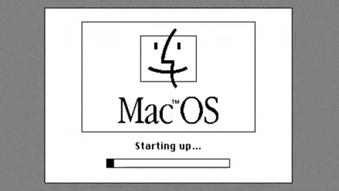
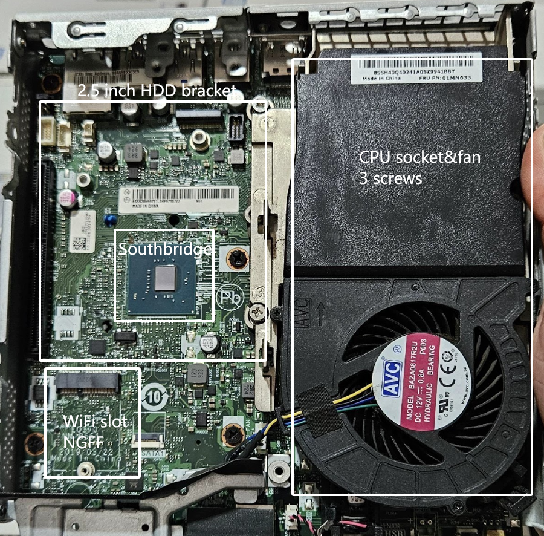
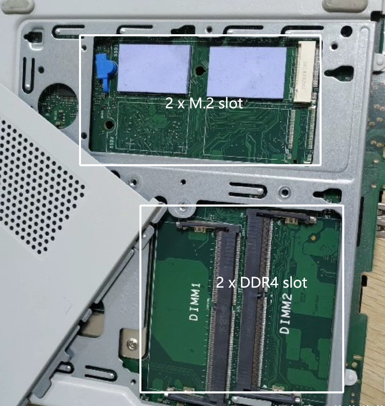
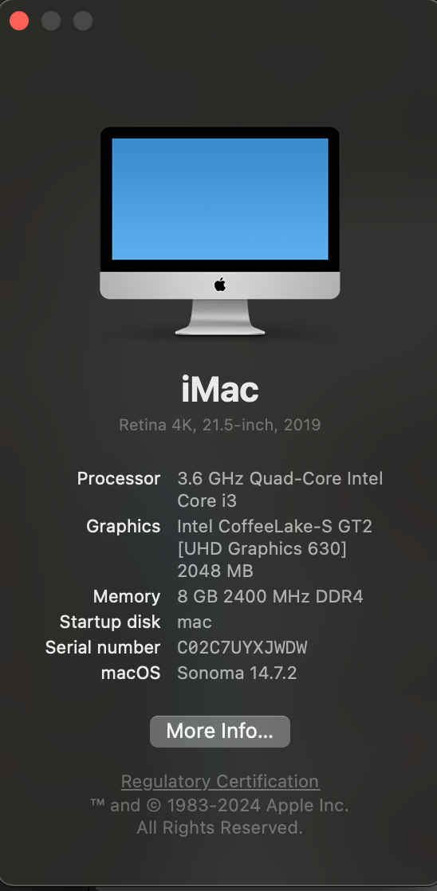

<h1 align="center">
  🌟NEC8-8100-Sonoma-EFI-Hackintosh🌟
</h1> 

<b>Journey with Hackintosh for NEC8.</b>

    <a href="./README.md#️my-setup"><Strong>Quick look on My build for NEC8</Strong></a> 
    <a href="./work/waytohackintosh.md" target="blank">Way to Hackintosh</a>
    ·
    <a href="./work/downgradeios14.md">Downgrade to iOS 14 with 8 Plus</a>
    ·
    <a href="./work/synergycomplie.md">Complie Synergy</a>

---
## 👀Hardware preview

<table>
<tr>
<td>

</td>
</tr>
</table>

💸Additional purchase information for expansion:

1️⃣Cooling kit for southbridge.

2️⃣2.5 inch HDD bracket and a sata cable connect to the motherboard.

3️⃣Wifi card with NGFF.

4️⃣Half height PCIe card.

## 🖥️My setup
|  Components   | Name  |
|  ----  | ----  |
| CPU  | i3-8100 |
| Moterboard  | B360 |
| Memory  | 1 x 8G DDR4 2400 |
| Graphic  | UHD630 |
| Storge  | 128G SSD |
|Audio|Realtek ALC235|
|Ethernet	|Intel I219-V|
| OS  | Sonoma 14.7.2 (Upgraded from Ventura) |
| OC  | 1.0.3 |
|Screenshot||

## 🛣️The journey

[Way to Hackintosh](./work/waytohackintosh.md)

[Downgrade to iOS 14 with 8 Plus](./work/downgradeios14.md)

[Complie Synergy](./work/synergycomplie.md)

