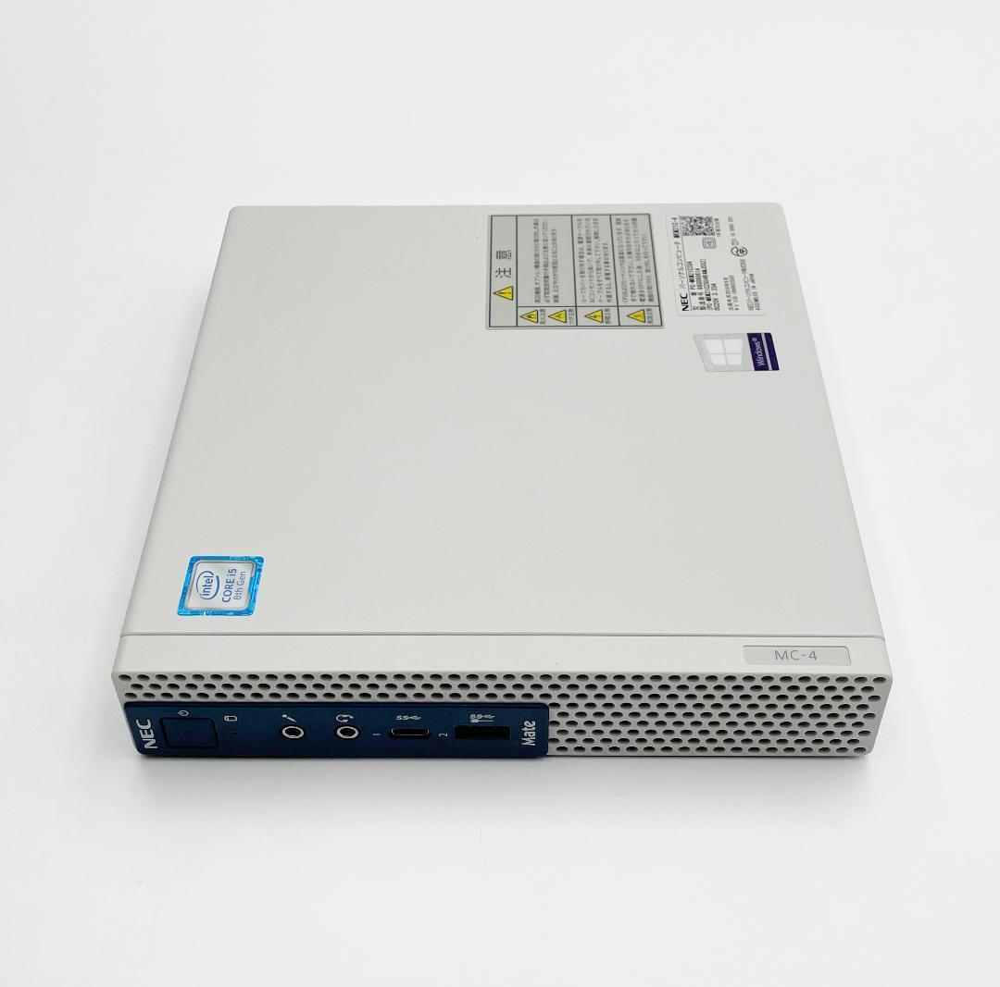

<h1 align="center">
  🌟NEC8-8100-Sonoma-EFI-Hackintosh🌟
</h1> 

<b><u>Journey with NEC8 for Hackintosh.</u></b>

[**Quick look on my build**](#️my-setup) [(*EFI download*)](https://github.com/wtfllix/NEC8-8100-Sonoma-EFI-Hackintosh/releases/download/20250116/EFI.zip)

<a href="./work/waytohackintosh.md" target="blank">Way to Hackintosh</a>·
<a href="./work/downgradeios14.md">Downgrade to iOS 14 with 8 Plus</a>·
<a href="./work/synergycomplie.md">Complie Synergy</a>

---
## 👀Hardware preview

<table>
<tr>
<td>

</td>
</tr>
</table>

> [!TIP]
> 💸Additional purchase information for expansion: 
> 1️⃣Cooling kit for southbridge. 
> 2️⃣2.5 inch HDD bracket and a sata cable connect to the motherboard. 
> 3️⃣Wifi card with NGFF. 
> 4️⃣Half height PCIe card. 

## 🖥️My setup

<table>
<tr>
<td>

|  Components   | Specification  |
|  ----  | :----: |
| CPU  |               i3-8100 |
| Moterboard  |           B360 |
| Memory  |   1 x 8G DDR4 2400 |
| Graphic  |            UHD630 |
| Storge  |           128G SSD |
|Audio|          Realtek ALC235|
|Ethernet	|        Intel I219-V|
| OS  |     Sonoma 14.7.2 (Upgraded from Ventura) |
| OC  |            1.0.3     [EFI download](https://github.com/wtfllix/NEC8-8100-Sonoma-EFI-Hackintosh/releases/download/20250116/EFI.zip)|

</td>
<td>
|
</td>
</tr>
</table>

## 🛣️The journey

[Way to Hackintosh](./work/waytohackintosh.md)

[Downgrade to iOS 14 with 8 Plus](./work/downgradeios14.md)

[Complie Synergy](./work/synergycomplie.md)

